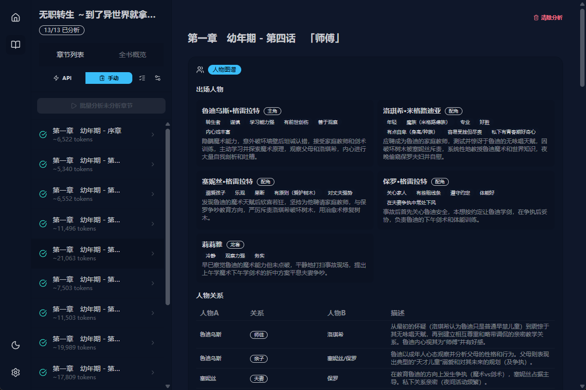

# NovelParser


**NovelParser** 是一款基于 Tauri v2 和 Rust 构建的跨平台 AI 小说/长文精读辅助工具。它可以智能导入并解析长篇电子书（EPUB、TXT），通过接入各类大语言模型，从微观到宏观帮助你深度解构文本的字里行间。



---

## 🌟 核心特性

### 1. 📖 智能文档解析
- **EPUB 支持**：完美保留并重新编排复杂的 Table of Contents 层级（合并多级碎子章节，拒绝排版稀烂的无意义短章）。
- **TXT 支持**：纯文本自动编码推断（支持 UTF-8, GBK, GB18030 等），内置强大正则表达式实现自动分章。
- **本地存储**：底层基于 SQLite，导入即本地永久私有保存，随时调阅毫无负担。

### 2. 🤖 AI 增强逐章深度分析
内置 8 大立体维度的文学向数据结构解析，你可以自由选配：
- 🥸 **人物塑造**（核心角色、边缘人物、心理活动、成长弧线）
- 🛤️ **剧情脉络**（起承转合、核心矛盾、转折点）
- 🔮 **伏笔隐喻**（回收暗示、象征物）
- 🖋️ **写作手法**（视角运用、节奏把控、叙事技巧）
- 🌪️ **修辞艺术**（环境渲染、细节描写）
- 🎭 **情感基调**（人物情绪爆发点、氛围压迫感）
- 💡 **核心主题**（暗藏的思想内涵探讨）
- 🌍 **世界观构建**（风土人情、设定抛出点）

**💡 智能分段机制**（Token Auto-split）：超长章节超出上下文时，会自动根据换行符切分为多段请求，最终通过内部逻辑再将分段评估**去重合并**，完整保留章节精髓！

### 3. 🛡️ 灵活的模型调用模式 (API & Manual)
无论你有无稳定直连 API 的能力，NovelParser 都准备了相应的方案：
- **直连模式**：填入即可直连任何兼容 `OpenAI SDK` 的推理服务（DeepSeek, GPT-4o, Claude 等），支持一键**流式输出 (Streaming JSON)** 观看推理实况与预估排队时间。
- **手动搬运模式**：点击生成 Prompt 并复制到任意对话机器人窗口（比如免费大模型网页端），接着将返回结果粘贴回分析区域，软件也会为你优雅地反序列化并渲染出完美的结论。

### 4. ⚡️ 一键批处理与全书总结
- **多选批处理**：提供直观强大的章节复选框。勾选后，一并删除无用章，或放入长队列进行批量并发分析，界面实时跟踪总进度与耗时。
- **全书终极概览**：看完或者测完大半本后，一键综合所有独立章节的数据，生成该部小说的终极书评、整体世界观与长线人物关系演变。
- **报告导出**：支持所见即所得的 Markdown 一键导出，方便将阅读笔记迁移到 Obsidian/Notion 等外部知识库中。

## 🛠️ 技术栈与架构 (Tech Stack)

此项目秉承了“薄前端，厚后端”的理念。
- **Backend (Rust & Tauri v2)**: 极限掌控性能与 I/O。利用 `rusqlite` 管理数据，`tokio` 运行 `async-openai` 异步并发与流式响应，手写解析 EPUB DOM 和正则表达式清洗纯文本。
- **Frontend (React 19 & TypeScript)**: 结合 Vite 极速构建。
- **UI & State**: TailwindCSS + DaisyUI 驱动高度可定制化的现代流式界面响应，支持多主题自由切换。全局状态主要由 `Zustand` 代理 IPC (Inter-Process Communication)，保持逻辑与渲染层的干净抽离。
- **CI/CD**：通过 Github Actions 矩阵编译 MacOS (AArch64/X86_64), Linux (Ubuntu) 和 Windows 可执行包。

## 🚀 起步 (Getting Started)

NovelParser 需要 Node.js 和 Rust 开发环境 (建议 Rust `1.80+`)。

1. **克隆项目并安装前端依赖**
   ```bash
   git clone https://github.com/your-username/NovelParser.git
   cd NovelParser
   pnpm install
   ```

2. **热更新开发 (Dev Mode)**
   ```bash
   cargo tauri dev
   ```

3. **打包生产版本 (Build for Release)**
   ```bash
   cargo tauri build
   ```

## 📜 详细文档
如果你有意向为 NovelParser 提供代码贡献或深入二次开发，请务必阅读我们准备好的详细内部实现：
- [开发综合指南 DEV-GUIDE](./.agent/workflows/dev-guide.md)

License: GPL-3.0
